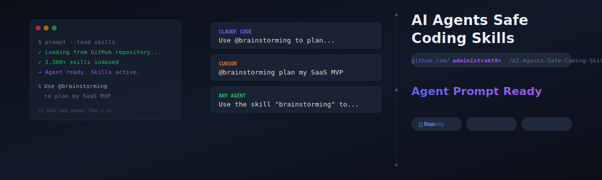

<p align="center">
  
</p>

<p align="center">
  <a href="https://github.com/administrakt0r/AI-Agents-Safe-Coding-Skills/stargazers"></a>
  <a href="https://github.com/administrakt0r/AI-Agents-Safe-Coding-Skills/releases/latest"></a>
  <a href="LICENSE"></a>
  <a href="#-quick-install"></a>
  <a href="https://github.com/administrakt0r/AI-Agents-Safe-Coding-Skills/discussions"></a>
</p>

<p align="center">
  <a href="https://claude.ai"></a>
  <a href="https://cursor.sh"></a>
  <a href="https://github.com/google-gemini/gemini-cli"></a>
  <a href="https://github.com/openai/codex"></a>
  <a href="https://github.com/opencode-ai/opencode"></a>
  <a href="https://github.com/features/copilot"></a>
</p>

<p align="center">
  <b>1,300+ battle-tested SKILL.md playbooks</b> that turn any AI coding agent into a specialized expert.<br>
  Planning · Coding · Debugging · Testing · Security · DevOps · Product · Marketing
</p>

---

<p align="center">
  <a href="#-quick-install"><b>⚡ Quick Install</b></a> &nbsp;·&nbsp;
  <a href="#-choose-your-agent"><b>🔧 Choose Your Agent</b></a> &nbsp;·&nbsp;
  <a href="#-top-starter-skills"><b>📚 Top Skills</b></a> &nbsp;·&nbsp;
  <a href="#-compatibility-table"><b>🔄 Compatibility</b></a> &nbsp;·&nbsp;
  <a href="#-more-from-the-author"><b>🌐 More Projects</b></a> &nbsp;·&nbsp;
  <a href="#-contributing"><b>🤝 Contribute</b></a>
</p>

---

## ⚡ Quick Install

> **One command. Every tool. Agent-ready in under a minute.**

<table>
<tr>
<td width="50%">

### 🟣 Claude Code

```bash
npx ai-agents-safe-coding-skills --claude
```

Then just ask:
```
>> /brainstorming plan my SaaS MVP
```

</td>
<td width="50%">

### 🟠 Cursor

```bash
npx ai-agents-safe-coding-skills --cursor
```

Then in chat:
```
@brainstorming plan my SaaS MVP
```

</td>
</tr>
<tr>
<td>

### 🔵 Gemini CLI

```bash
npx ai-agents-safe-coding-skills --gemini
```

Then just say:
```
Use brainstorming to plan a SaaS MVP
```

</td>
<td>

### 🟢 Codex CLI

```bash
npx ai-agents-safe-coding-skills --codex
```

Then just say:
```
Use brainstorming to plan a SaaS MVP
```

</td>
</tr>
<tr>
<td>

### ⚪ OpenCode

```bash
npx ai-agents-safe-coding-skills --path .agents/skills
```

Then run:
```bash
opencode run @brainstorming "plan my SaaS MVP"
```

</td>
<td>

### 🔴 Antigravity

```bash
npx ai-agents-safe-coding-skills --antigravity
```

Then in agent mode:
```
Use @brainstorming to plan a SaaS MVP
```

</td>
</tr>
<tr>
<td colspan="2">

### 🌐 Universal (any tool, any path)

```bash
npx ai-agents-safe-coding-skills --path ./my-tool/skills
```

Or clone manually:

```bash
git clone https://github.com/administrakt0r/AI-Agents-Safe-Coding-Skills.git ./my-skills
```

</td>
</tr>
</table>

---

## 🧠 What Are Agentic Skills?

<p align="center">
  
  
</p>

**Skills are not tools.** Tools give an agent capabilities (read a file, call an API). Skills give an agent *operating instructions* — the playbook for *how* to execute a workflow well.

| Concept | What It Does | Example |
|---------|-------------|---------|
| **Skill** (SKILL.md) | Teaches the agent *how* to work | `@systematic-debugging` — reproduce → isolate → fix → verify |
| **MCP Tool** | Gives the agent *capabilities* | `filesystem` — read, write, search files |
| **Bundle** | Curated skill packs by role | `Security Engineer` — 12 security-focused skills |
| **Workflow** | Ordered execution playbooks | "Ship a SaaS MVP" — plan → scaffold → implement → test → deploy |

> **TL;DR:** Tools = *what the agent can do*. Skills = *how the agent should think and work*.

---

## 🔧 Choose Your Agent

Click your tool below for a jump-start guide with the right install path, starter skills, and first prompts:

<table align="center">
<tr>
<td align="center" width="25%">
  <a href="docs/users/claude-code-skills.md">
    <br>
    <sub><code>>> /skill-name</code></sub>
  </a>
</td>
<td align="center" width="25%">
  <a href="docs/users/cursor-skills.md">
    <br>
    <sub><code>@skill-name</code></sub>
  </a>
</td>
<td align="center" width="25%">
  <a href="docs/users/gemini-cli-skills.md">
    <br>
    <sub><code>Use skill-name</code></sub>
  </a>
</td>
<td align="center" width="25%">
  <a href="docs/users/codex-cli-skills.md">
    <br>
    <sub><code>Use skill-name</code></sub>
  </a>
</td>
</tr>
</table>

---

## 🔄 Compatibility Table

| Tool | Type | Invocation | Install Path |
|------|------|-----------|-------------|
| **Claude Code** | CLI | `>> /skill-name help me...` | `.claude/skills/` |
| **Gemini CLI** | CLI | `Use skill-name...` | `.gemini/skills/` |
| **Codex CLI** | CLI | `Use skill-name...` | `.codex/skills/` |
| **Kiro CLI** | CLI | Auto-loads on-demand | `~/.kiro/skills/` / `.kiro/skills/` |
| **Kiro IDE** | IDE | `/skill-name` or auto | `~/.kiro/skills/` / `.kiro/skills/` |
| **Antigravity** | IDE | `Use @skill-name` in agent mode | `~/.gemini/antigravity/skills/` / `.agent/skills/` |
| **Cursor** | IDE | `@skill-name` in chat | `.cursor/skills/` |
| **Copilot** | Ext | Paste content manually | N/A |
| **OpenCode** | CLI | `opencode run @skill-name` | `.agents/skills/` |
| **AdaL CLI** | CLI | Auto-loads on-demand | `.adal/skills/` |

---

## 📚 Top Starter Skills

<p align="center">
  <a href="skills/brainstorming/SKILL.md"></a>
  <a href="skills/architecture/SKILL.md"></a>
  <a href="skills/test-driven-development/SKILL.md"></a>
  <a href="skills/systematic-debugging/SKILL.md"></a>
  <a href="skills/security-auditor/SKILL.md"></a>
  <a href="skills/frontend-design/SKILL.md"></a>
  <a href="skills/api-design-principles/SKILL.md"></a>
  <a href="skills/doc-coauthoring/SKILL.md"></a>
  <a href="skills/create-pr/SKILL.md"></a>
  <a href="skills/lint-and-validate/SKILL.md"></a>
</p>

### Quick Recipe: Bootstrap Any Agent

Copy-paste this into your agent of choice to load the essentials instantly:

```text
Load the following skills from this repository:
https://github.com/administrakt0r/AI-Agents-Safe-Coding-Skills

@brainstorming @concise-planning @app-builder @backend-dev-guidelines
@frontend-developer @database-design @test-driven-development @verification-before-completion

Work in phases: plan → scaffold → implement → test → verify.
Start by inspecting the current codebase and proposing the smallest viable plan.
```

<br>

| Domain | Skills You'll Use |
|--------|------------------|
| 🏗️ **Architecture** | `architecture`, `c4-context`, `senior-architect`, `microservices-patterns` |
| 🎨 **Frontend** | `frontend-design`, `react-patterns`, `web-design-guidelines`, `browser-automation` |
| ⚙️ **Backend** | `backend-dev-guidelines`, `api-patterns`, `database-design`, `docker-expert` |
| 🧪 **Testing** | `test-driven-development`, `testing-patterns`, `test-fixing`, `qa-automation` |
| 🔒 **Security** | `security-auditor`, `api-security-best-practices`, `vulnerability-scanner` |
| 🚀 **DevOps** | `deployment-procedures`, `aws-serverless`, `vercel-deployment`, `observability-engineer` |
| 🧠 **AI/ML** | `prompt-engineer`, `rag-engineer`, `langgraph`, `ai-agent-development` |
| 📈 **Growth** | `copywriting`, `seo-audit`, `pricing-strategy`, `ab-testing` |

**[Browse the full catalog →](CATALOG.md)** · **[Role-based bundles →](docs/users/bundles.md)** · **[Step-by-step workflows →](docs/users/workflows.md)**

---

## 🌐 More From The Author

<p align="center">
  <a href="https://github.com/administrakt0r"></a>
  <a href="https://x.com/administrakt0r"></a>
  <a href="https://buymeacoffee.com/administrakt0r"></a>
</p>

<br>

<table>
<tr>
<td align="center" width="33%">
  <a href="https://llm.kiwi">
    
  </a>
  <br><br>
  <b>LLM.Kiwi</b> — The best AI tools directory on the internet.<br>
  Find, compare, and launch AI tools for coding, content, automation &amp; more.
  <br><br>
  <a href="https://llm.kiwi"><sub>🔗 Visit llm.kiwi →</sub></a>
</td>
<td align="center" width="33%">
  <a href="https://wpineu.com">
    
  </a>
  <br><br>
  <b>WPineu</b> — Professional web development &amp; WordPress solutions.<br>
  Custom themes, plugins, and high-performance websites tailored to your business.
  <br><br>
  <a href="https://wpineu.com"><sub>🔗 Visit wpineu.com →</sub></a>
</td>
<td align="center" width="33%">
  <a href="https://callerhouse.com">
    
  </a>
  <br><br>
  <b>CallerHouse</b> — Enterprise VoIP &amp; telephony solutions.<br>
  Cloud PBX, SIP trunking, and business phone systems that scale.
  <br><br>
  <a href="https://callerhouse.com"><sub>🔗 Visit callerhouse.com →</sub></a>
</td>
</tr>
</table>

---

## 🎯 Quick Workflows (Copy-Paste)

### Start a New Web Project

```text
Use these skills:
@brainstorming @concise-planning @writing-plans @app-builder
@backend-dev-guidelines @frontend-developer @database-design @test-driven-development

I want to start a new project: [describe your app].

First choose the simplest stack, create a short plan, scaffold the project,
implement the first end-to-end slice, and add tests. Keep scope MVP-small.
```

### Debug Like a Pro

```text
Use these skills:
@systematic-debugging @test-fixing @browser-automation @verification-before-completion

This project is broken: [paste error/symptoms].

Reproduce → isolate → explain root cause → implement the smallest fix → verify.
Do NOT refactor unrelated code while debugging.
```

### Pre-Launch Security Hardening

```text
Use these skills:
@architect-review @security-auditor @deployment-procedures
@observability-engineer @verification-before-completion

Review this repo for architecture gaps, security risks, deployment issues,
and observability blind spots. Fix the highest-value issues and deliver a release checklist.
```

**[More workflows →](docs/users/workflows.md)**

---

## 📦 Project Structure

```
├── skills/          ← 1,300+ SKILL.md playbooks (the library)
├── docs/            ← User guides, contributor docs, maintainer docs
├── tools/           ← CLI installer, validators, generators
├── data/            ← Generated catalogs, indexes, bundles
├── scripts/         ← Activation scripts, maintenance helpers
├── plugins/         ← Claude Code & Codex plugin distributions
├── CATALOG.md       ← Full browsable skill catalog
└── package.json     ← npm package with installer CLI
```

---

## 🤝 Contributing

We welcome community contributions! Here's how:

<table>
<tr>
<td width="50%">

### Add a New Skill

```bash
# 1. Create the skill
mkdir -p skills/my-skill-name
cp docs/contributors/skill-template.md skills/my-skill-name/SKILL.md

# 2. Edit the SKILL.md with your workflow
# 3. Validate before submitting
npm run validate

# 4. Open a PR!
```

See [`CONTRIBUTING.md`](CONTRIBUTING.md) for details.

</td>
<td width="50%">

### Community Skills

- [Overnight Worker](https://github.com/fullstackcrew-alpha/skill-overnight-worker) — Autonomous overnight coding agent
- [HubSpot Admin Skills](https://github.com/TomGranot/hubspot-admin-skills) — 32 skills for CRM automation
- [CoinPaprika Skills](https://github.com/coinpaprika/skills) — Crypto data skills (no API key needed)
- [Debug Skill](https://github.com/AlmogBaku/debug-skill) — Interactive debugger with breakpoints for Python, Go, Node, Rust

</td>
</tr>
</table>

---

## 🛡️ Security

This repository is actively maintained and continuously reviewed. Skills can include risky operations by design — they are instruction playbooks, not sandboxed code.

- All `SKILL.md` files undergo automated security scanning for high-risk patterns
- Autonomous + human review flows check for prompt injection, suspicious tool chaining, and unsafe commands
- Pull requests that touch `SKILL.md` files run automated `skill-review` GitHub Actions checks
- Skills that become obsolete or unsafe are revised, modernized, or removed

Read [`SECURITY.md`](SECURITY.md) for the full posture.

---

## ⭐ Star History

<p align="center">
  <a href="https://star-history.com/#administrakt0r/AI-Agents-Safe-Coding-Skills">
    
  </a>
</p>

<p align="center">
  <b>If this library saves you time, drop a ⭐ — it helps more developers find it.</b>
</p>

---

## 📜 License

<p align="center">
  
  
</p>

Original code and tooling: **MIT License** ([LICENSE](LICENSE)).  
Documentation and written content: **CC BY 4.0** ([LICENSE-CONTENT](LICENSE-CONTENT)).  
Third-party attributions: [`docs/sources/sources.md`](docs/sources/sources.md).

---

## 🌟 Contributors

<p align="center">
  <a href="https://github.com/administrakt0r/AI-Agents-Safe-Coding-Skills/graphs/contributors">
    
  </a>
</p>

<p align="center">
  <sub>Made with ❤️ by <a href="https://github.com/administrakt0r">administrakt0r</a> and the open-source community.<br>
  <a href="https://github.com/administrakt0r/AI-Agents-Safe-Coding-Skills/discussions">💬 Join the discussion</a> · <a href="https://github.com/administrakt0r/AI-Agents-Safe-Coding-Skills/issues">🐛 Report a bug</a></sub>
</p>

<p align="center">
  <br>
  <a href="https://llm.kiwi"><sub>🔗 llm.kiwi</sub></a>&nbsp;·&nbsp;
  <a href="https://wpineu.com"><sub>🔗 wpineu.com</sub></a>&nbsp;·&nbsp;
  <a href="https://callerhouse.com"><sub>🔗 callerhouse.com</sub></a>
</p>
